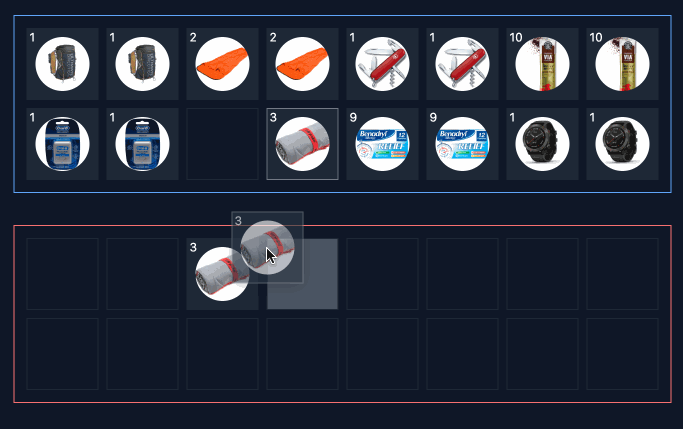

<div align="center">

  # Vue 3 Containers Prototype

  A dependency-free drag and drop system built in Vue (Nuxt) 3.

  
</div>

## ToDo

- [ ] Can import component into another project
- [x] Can drag items between containers
- [ ] Can control the amount of an item dragged between containers
- [ ] Has clean API
- [ ] API is documented


## Basic usage

```html
<container :items="items" @move="onMove" />

<script>
  const items = initialItems;

  const onMove = ({itemId, from: {}, to: { }}) => {

  }
</script>
```

## API

### <container&gt;

#### Props

| name | type   | default   | description |
|------|--------|-----------|-------------|
| id   | `number` | required  | Used to identify which container the item is in.|
| items | `(item\|null)[]` | [] | The items in the cells.|
| rows | `number` | 2 | The amount of rows to show in the container.|
| cols | `number` | 2 | The amount of columns to show in the container. |
| theme | `"blue"\|"red"\|"white"` | `"white"` | The container border colour. |

#### Events

| name | props | description |
|------|--------|-----------|
| @move | `MoveEvent` | This event fires after having dragged and dropped the item in a new cell |

## Types

```typescript
interface Container {
  id: number
  name: string
  theme: 'white' | 'red' | 'blue'
  items: (containerItem | null)[]
  rows: number
  cols: number
}
```

```typescript
interface Item {
  id: number
  name: string
  image: string | null
}
```

```typescript
interface MoveEvent {
  id: number
  name: string
  image: string | null
}
```

## Tools

```typescript
tools.container(container).create(): Container                                  // create a container
tools.container(container).findCell(1): Cell                                    // find a cell in a container
tools.container(container).clearCell(1): Container                              // clear a cell in a container
tools.container(container).depositCell(1, item, amount)                         // deposit an item in a cell
tools.container(container).depositFirstAvailableCell(item, amount): Container   // deposit an item in the first available cell
tools.containers(containers).findCell(path): Container                          // find a cell in a container
tools.containers(containers).clearCell(path): Container                         // clear a cell in a container
tools.containers(containers).depositCell(path, item, amount): Container         // deposit an item in a cell
tools.containers(containers).switchCells(pathA, pathB): Container               // switch two cells
tools.containers(containers).moveCell(fromPath, toPath): Container              // move a cell
tools.catalogue.createItem(item): Item                                          // Create an item
tools.catalogue.findItemById(items, id): Item                                   // Find an item by id
```